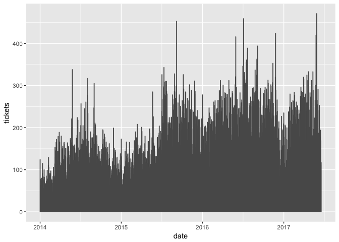
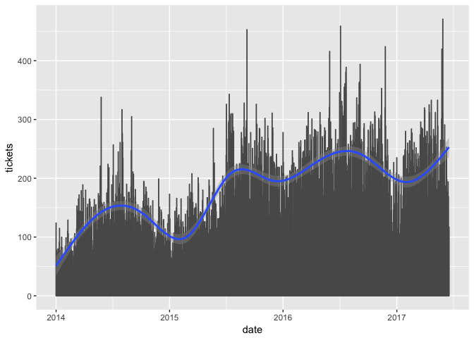
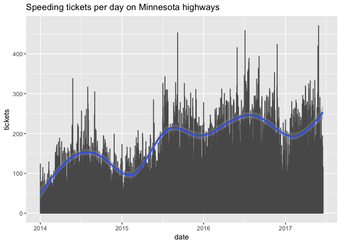
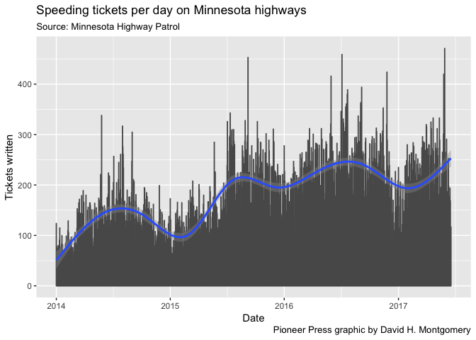
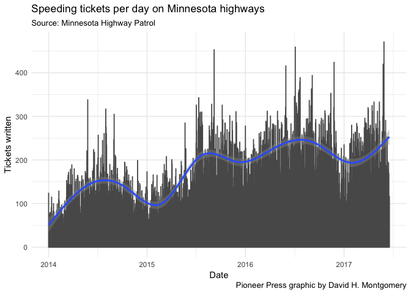
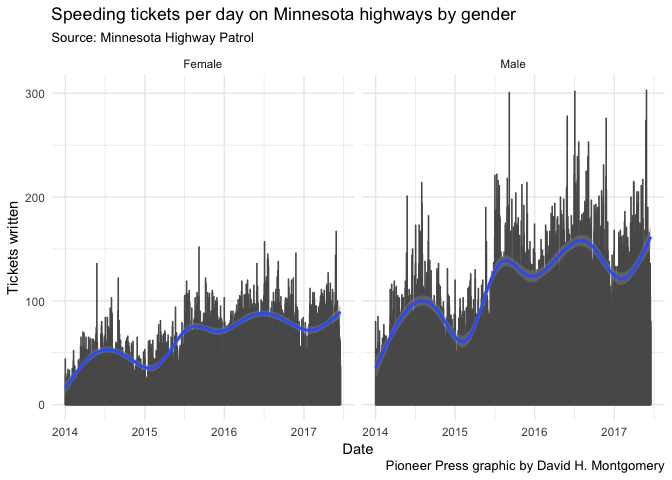
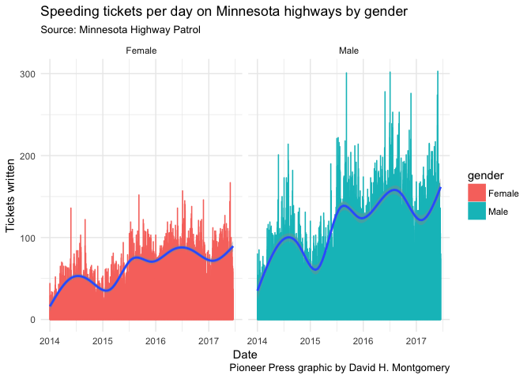

Coding for beginners
================
David Montgomery
8/7/2017

If you aren't fully set up for this lesson, follow the instructions [here](https://github.com/dhmontgomery/r-data-for-beginners/blob/master/README.md).

Introduction
------------

You've all probably used a program like Excel to analyze data before. That's good! Spreadsheets are very powerful tools for tracking, analyzing and visualizing information.

But as someone who works with data, you should also consider how code can be another tool in your toolbox — one that can greatly expand what you can do with datasets.

Why use code over spreadsheets? There's three big (and alliterative!) reasons:

1.  **Rapid:** It can be far faster to do things with code than with slow programs like Excel — especially if you're dealing with really large datasets.
2.  **Repeatable:** Code can be easily adapted for new or similar datasets. It might take you longer to analyze one spreadsheet in code vs. Excel — but when you get the next month's report you'll be able to adapt your old code in minutes, while in Excel you'd have to do everything again.
3.  **Reproducible:** If you do an analysis with code, you produce a script — a step-by-step list of various things you did to the data. Not only does this mean you can **repeat** what you did, it means you can show your work. That fits with the spirit of transparency journalists demand from others, and could help to build up trust in media at a time when it's under attack.

You'll also find that coding might be a lot easier than you thought it was.

Over the coming hour, I'll walk you through some basic coding functions that you can use to analyze data, discover cool insights and graph them. I'll walk you through each step, so *you don't need to know anything about code to begin.* When done, you'll be able to apply what you've learned to similar analyses of other datasets.

There are lots of coding languages, each of which is good at different things. For this exercise, I'll be using a language called "R", which is particularly good for data, stats and visualizations.

Getting started
---------------

You all have a program on your computers called RStudio. Open it up now.

You'll see that the screen is divided into three sections. On the left is the Console — that's where you'll type in your code. You should see a `>` symbol with a cursor next to it.

The other two sections we can ignore for now.

Before we do anything, let's talk a little bit about how code is structured. It can seem a little impenetrable at first, but there's a method to the madness. Just like the rules of grammar let you build new sentences out of disparate words, code has its own grammar with regular rules.

The core of R are "functions." Think of them as **verbs** — a function *does something*. Functions all have names, like `sum` or `round`.

Our verbs (functions) also take nouns — the things that the function acts upon. They're called variables, and they go inside parentheses after functions. This is just like working with formulas in Excel, except you don't have to type `=` beforehand.

Here's a simple example:

``` r
sum(1, 2, 3, 4, 5)
```

If you want to, you can copy and paste or type that command into the Console and hit enter:

    sum(1, 2, 3, 4, 5)
    [1] 15

So far we've got verbs (functions) and nouns (variables). The other important part of our coding grammar are adverbs — things that modify how verbs work. These are called "parameters."

For example, the function `read.csv()` loads a spreadsheet from your desktop into RStudio. It takes a variable that identifies which spreadsheet you want to load. But it can also take parameters. For example, you can tell it whether the first line of the spreadsheet contain column headers, or if they're data.

``` r
read.csv("test.csv", header = TRUE)
```

Don't run that — you don't have a "test.csv" so it won't work. But you can see how this grammar works — inside a function you can specify both variables and parameters. You could run the above code with `header = FALSE`, too, depending on what you needed.

So far we've talked about variables that already exist — files, or numbers. But you can also really easily create your own variables, using `<-`. That's called the "assignment operator", and it's a very basic function that you can think of like the verb "to be".

`my_value <- sum(1, 2, 3, 4,5)` essentially means `my_value` IS the sum of 1, 2, 3, 4 and 5. Try entering that line of code in your console. Then type `my_value` into the console and hit enter. What do you get?

That value is now associated with `my_value` until you change it. That means you can do things with it. Try entering `my_value + 1` in the console.

We assigned a very basic value to a variable, but variables can be much more complex. A variable can refer to a single number, a string of words, a whole spreadsheet, or more.

Getting our data
----------------

We're doing to be working with a spreadsheet that'd be tricky to work with in a conventional spreadsheet: a dataset of speeding tickets issued by the Minnesota State Patrol over the past 3.5 years. There are 224,915 different tickets in the dataset, and even though I've removed some extraneous data, the file is still nearly 15 MB. That's too big for Excel to handle comfortably. (Before Excel 2007, it couldn't have handled it at all.) R will handle it easily, though.

Before we begin, we need to do one thing. Copy and paste the following code into your console:

``` r
library(tidyverse)
```

R includes a number of functions, but you can also load scripts anyone else has written into it. We just loaded a package of functions called the "tidyverse" that's particularly useful for data work. Now that we've loaded it, R will know what to do with some of the code we're about to use.

Now let's get our data. We're going to use that `read.csv` function we discussed earlier to load the CSV spreadsheet from our desktop — and we're going to assign the output of that function, our loaded spreadsheet, to a variable. Run this:

``` r
speeding <- read.csv("speedingdata.csv", stringsAsFactors = FALSE)
```

It took a few seconds to load because of the file's size, but this still happened far faster than Excel would have opened that same file. (Ignore that `stringsAsFactors` parameter there; it's important but isn't worth the time to [explain why](https://simplystatistics.org/2015/07/24/stringsasfactors-an-unauthorized-biography/).)

In RStudio, we're now going to look at one of the panes we ignored earlier. In the upper-right, there's a pane called "Environment", and in it, you can see two items — the two variables we've defined, `my_value` and `speeding`. Click on `speeding` — and notice a new panel appear on the top of the left side of the screen. You can preview your data there!

(If you wanted to, you could also enter `speeding` into the console to see it there, like we did earlier for `my_value`. But **don't do this** — `my_value` was a single number, while `speeding` has 224,915 rows. That's a lot of scrolling.)

You can see our spreadsheet has seven columns: `datetime`, `violation_city`, `violation_county`, `actual_speed`, `posted_speed`, `age` and `violator_sex`. Scroll through the spreadsheet a little.

Basic analysis
--------------

We've got this massive spreadsheet (also called a "data frame" in R). What can we learn from it? Run the following line of code:

``` r
mean(speeding$actual_speed, na.rm = TRUE)
```

We just calculated the average miles per hour for all 224,915 speeding tickets in the database!

The `na.rm = TRUE` part there was a parameter that was needed because a few rows in the data are missing this data. We needed to tell R to remove empty rows by setting this parameter to true. (Computers are *very* literal.)

More important is that dollar sign. The dollar sign is a special piece of coding punctuation that modifies variables. When you have a variable that's a data frame (spreadsheet), the dollar sign indicates which column of the spreadsheet you want. So `speeding$actual_speed` means the `actual_speed` column of the `speeding` data frame.

Try to use this basic grammar to calculate the average age of all the tickets in the dataset. Use our function for the average speed as a template and change what you need to.

The `$` operator is really powerful. It can even work on columns that don't exist yet! Let's say we want to add a new column to the spreadsheet that records the number of miles over the posted speed limit each driver was going. Essentially, we want to subtract `posted_speed` from `actual_speed`.

Adding a new column is easy. Remember how we created a new variable with the `<-` operator? We can also modify variables with it. Let's build a coding "sentence" out of several parts.

First, we want to identify the variable we want to operate on. It's the `speeding` data frame, yes, but not all of `speeding`. What we want to do is act on this nonexistent column. Let's call it `miles_over`. So our code will start like this:

``` r
speeding$miles_over <-
```

That will create a new column and populate it with whatever we put on the right side. So if we wanted to, we could run `speeding$miles_over <- 1` and it will fill every row of the column with the number 1. You can try this if you want, there's no harm. Everything we do to this spreadsheet is being done to **the copy we've loaded into R** — the original file remains on your computer, unchanged. So if the worst happens and you irreparably mess up the data frame, you can just repeat your steps so far. If you keep each line of code in a text file (RStudio can make one for you), you can even paste multiple lines of code into the console at once and R will run them all!

In this case, we want to make this column more than just a fixed number. We want it to be `actual_speed` minus `posted_speed`.

Remember before we were able to do math with simple variables? We can also do it with complex variables that represent whole 224,915-row columns of data. R is smart enough to know that if you subtract one column from another, what you want it to do is subtract **each row** of those respective columns. So here's the second half of our code:

``` r
speeding$miles_over <- speeding$actual_speed - speeding$posted_speed
```

That happened basically instantly. Take a look at the data preview pane. You should see the new column there! (If it's not, refresh it by clicking `speeding` in the Environment pane again.) Scroll through and double-check that it did the math right. You can do this in the R console by entering things like `94 - 55`.

Diving deeper
-------------

So far we've been moving one step at a time. But we can leverage this coding grammar to be even more powerful by adding something new: conjunctions.

That library of functions we loaded earlier contains this operator: `%>%`. That effectively means "and then". Here's an example using some functions we haven't met yet:

``` r
speeding_counties <- speeding %>% 
    filter(miles_over >= 0) %>% 
    group_by(violation_county) %>% 
    summarize(avg_miles_over = mean(miles_over, na.rm = TRUE)) %>% 
    arrange(desc(avg_miles_over))
```

Run that code, then click `speeding_counties` in your Environment pane. What do you see?

Now let's break down everything we did here:

-   `speeding_counties <-`: Create a new variable, `speeding_counties`, and fill it with what follows `<-`.
-   `speeding %>%`: Take our `speeding` data frame to start, and then pass it forward to the next step.
-   `filter(miles_over >= 0) %>%`: Take the output of the last step (`speeding`) and filter it to exclude any tickets where `miles_over` is less than zero (bad data). Then pass this on to the next step.
-   `group_by(violation_county) %>%`: Take the output of the last step (a filtered `speeding`) and group it by the county where the violation occurred. Then pass this on to the next step.
-   `summarize(avg_miles_over = mean(miles_over, na.rm = TRUE)) %>%`: Take the output of the last step (a filtered `speeding` grouped by county) and for each county create a variable called `avg_miles_over` that's defined as the average `miles_over` for that county. Then pass this on to the next step.
-   `arrange(desc(avg_miles_over))`: Take the output of the last step (a table with average miles over for each county) and sort it by `avg_miles_over` in descending order.

Now you see why I describe programming as being like a grammar. It's a series of verbs and nouns that you string together into "sentences" to produce results!

(Note that we weren't using the `$` operator in that code. That's because the library we loaded earlier handles that for us — as long as we've got a code sentence going starting with an input data frame like `speeding`, it assumes that we're referring to that data frame and lets us save characters. Think of it like a pronoun. If you're not using `tidyverse` functions you'll still need to use the `$`.)

Let's try using this same syntax to do something else. In RStudio, click File &gt; New File &gt; R Script. Paste the block of code from above in here. Let's **edit** this code to try to calculate the maximum miles per hour ticketed in each city in Ramsey County.

Hints:

-   We want to define this new table as something other than `speeding_counties`
-   The `max()` function operates just like `mean()`.
-   We'll need to filter down to just Ramsey County (and check how Ramsey County is formatted in the data)
-   To filter equal to a value, you need to use the `==` symbol — two equals signs.
-   You'll still want to filter out negative `miles_over`
-   Remember that what we want to calculate is **actual speed**, not miles over. Take a look at the different columns available to us.
-   The `filter()` function can filter by more than one thing. Just separate each argument inside `filter()` with commas.

Once you've edited this code how you want in RStudio's text editor, you can run this all at once. Just select the code you want to run, as many lines as you want, and hit Control-Enter (Command-Enter on a Mac).

There are other `tidyverse` functions besides `filter()`, `group_by()`, `summarize()` and `arrange()`, but not that many. You can do almost anything you want to do with data with less than a dozen functions!

Graphs!
-------

Now for the fun part. We've analyzed data, now let's graph it. Here's the total number of tickets written each day:

``` r
library(lubridate)
ggplot(speeding %>% group_by(date = date(datetime)) %>% summarize(tickets = n()), aes(date, tickets)) +
    geom_col(color = "grey35")
```



Run that code yourself and take a look in the lower-right corner of RStudio — a graph should appear!

Let's break down what we did there. We're using a library called `ggplot` that's included in the `tidyverse`. It uses the same principles were were using earlier (with the annoying exception that we combine lines of code with `+` instead of `%>%`; this is a relic).

The way `ggplot` works is every graph starts with the `ggplot()` function, which essentially creates a blank graph. All `ggplot()` functions have two parts:

1.  The data frame you want to graph
2.  Which columns of that data frame are going to represent different parts of the graph — which will be the X-variable, which will be the Y, which will determine color or fill, etc. These are called **aesthetics**.

But `ggplot()` just creates a blank graph. After calling that, you need to add layers to it. Each line of code, stacked together with `+`, adds a layer. The most basic layers are called **geometries** or **geoms** — these are the points, lines, bars and other elements that actually graph the data. Other layers don't add anything new themselves, but change other things about the graph — formatting the axes or changing the background color.

Once you get the hang of it, it's immensely powerful. You can start with a basic graph and just string layers together, winding up with something very polished in not much time at all.

Let's break down what we did above:

-   `library(lubridate)`: We loaded another library, this one designed to make dealing with dates and times easier.
-   `ggplot(...)`: All graphics start with a call to the `ggplot()` function
-   `speeding %>% group_by(date = date(speeding$datetime)) %>% summarize(tickets = n())`: This entire chunk is the left side of our `ggplot()` function — the data frame we want to graph. In this case, we took our `speeding` data, grouped it by date, and then counted the number of tickets for each day.
-   `aes(date, tickets)`: This is the second half of `ggplot()`, the **aesthetics**. Here we're telling it that we want `date` on the x-axis and `tickets` on the y-axis. Another way to write this would be `aes(x = date, y = tickets)` but `ggplot()` assumes that the first two entries you give it are `x` and `y`, so you can leave those out if you want.
-   `+`: This symbol at the end of the line tells `ggplot` that we want to keep going and add another layer.
-   `geom_col(color = "grey35")`: Here we're adding a **geometry** layer. `geom_col()` is, unsurprisingly, a column or bar chart. We also set the `color` (the outline) of each bar to match the `fill` so we have a smooth, unseparated plot. This wasn't necessary — we'd have still gotten a working chart if we'd just run `geom_col()`, it just wouldn't have looked as pretty.

### Experiment

Clear out the old code from your RStudio text document and paste in the above `ggplot()` code. Then edit it to try to answer the following questions:

-   Try deleting `color = "grey35"` from the function. What's different?
-   What happens if you just run `ggplot(speeding %>% group_by(date = date(speeding$datetime)) %>% summarize(tickets = n()), aes(date, tickets))` without adding a geometry?
-   What happens if you put `fill = "red"` inside `geom_col()` where `color = "grey35"` was?
-   What happens if you change `geom_col(...)` to `geom_point()` or `geom_line()`?

Better graphs
-------------

We got a basic, functional graph there. But we can keep going and make it much better. Let's take our previous function and add another geometry to it:

``` r
ggplot(speeding %>% group_by(date = date(datetime)) %>% summarize(tickets = n()), aes(date, tickets)) +
    geom_col(color = "grey35") +
    geom_smooth()
```



The lines jumped up and down a lot, so with `geom_smooth()` we added a trendline that shows more clearly that the number of tickets has gone up.

But the graph's a bit confusing for a reader, isn't it? Let's add another layer.

``` r
ggplot(speeding %>% group_by(date = date(datetime)) %>% summarize(tickets = n()), aes(date, tickets)) +
    geom_col(color = "grey35") + 
    geom_smooth() +
    labs(title = "Speeding tickets per day on Minnesota highways")
```



The `labs()` function can do a lot more than just add a title:

``` r
ggplot(speeding %>% group_by(date = date(datetime)) %>% summarize(tickets = n()), aes(date, tickets)) +
    geom_col(color = "grey35") + 
    geom_smooth() +
    labs(title = "Speeding tickets per day on Minnesota highways",
         subtitle = "Source: Minnesota Highway Patrol",
         caption = "Pioneer Press graphic by David H. Montgomery",
         x = "Date",
         y = "Tickets written")
```



Let's say you don't like the grey background. That's easy:

``` r
ggplot(speeding %>% group_by(date = date(datetime)) %>% summarize(tickets = n()), aes(date, tickets)) +
    geom_col(color = "grey35") + 
    geom_smooth() +
    labs(title = "Speeding tickets per day on Minnesota highways",
         subtitle = "Source: Minnesota Highway Patrol",
         caption = "Pioneer Press graphic by David H. Montgomery",
         x = "Date",
         y = "Tickets written") +
    theme_minimal()
```



I'll show off a few more tricks. (This isn't as simple as adding a layer — I had to go back to our `ggplot()` function and alter the data we put in before adding the `facet_wrap()` layer.) Try running the code below:

``` r
ggplot(speeding %>% filter(violator_sex != "") %>% group_by(date = date(datetime), gender = violator_sex) %>% summarize(tickets = n()), aes(date, tickets)) +
    geom_col(color = "grey35") + 
    geom_smooth() +
    labs(title = "Speeding tickets per day on Minnesota highways by gender",
         subtitle = "Source: Minnesota Highway Patrol",
         caption = "Pioneer Press graphic by David H. Montgomery",
         x = "Date",
         y = "Tickets written") +
    theme_minimal() +
    facet_wrap(~ gender)
```



(Notice how I renamed `violator_sex` to `gender` to make it easier to type.)

Let's add a splash of color! Earlier we saw how adding `fill = "red"` to a geometry could change the fill of the bars. But we can also assign colors based on our data. So we're going to add `aes(fill = gender, color = gender)` to the inside of `geom_col()`:

``` r
ggplot(speeding %>% filter(violator_sex != "") %>% group_by(date = date(datetime), gender = violator_sex) %>% summarize(tickets = n()), aes(date, tickets)) +
    geom_col(aes(fill = gender, color = gender)) + 
    geom_smooth() +
    labs(title = "Speeding tickets per day on Minnesota highways by gender",
         subtitle = "Source: Minnesota Highway Patrol",
         caption = "Pioneer Press graphic by David H. Montgomery",
         x = "Date",
         y = "Tickets written") +
    theme_minimal() +
    facet_wrap(~ gender)
```



Final experiments
-----------------

If we've still got some time left, let's do one more exercise together. Let's think back on our dataset, which has date, city, county, actual speed, posted speed, age, sex and miles over the limit. What else might we want to graph?

Using the basic coding grammar we picked up earlier, let's try to isolate the data we want to graph, and then build a graph from scratch to visualize it!

Further exploration
-------------------

-   Download R for [Mac](https://mirror.las.iastate.edu/CRAN/bin/macosx/), for [Windows](https://mirror.las.iastate.edu/CRAN/bin/windows/) or for [Linux](https://mirror.las.iastate.edu/CRAN/bin/linux/). You have to do this before you can download RStudio.
-   [Download RStudio](https://www.rstudio.com/products/rstudio/download/#download)
-   [A free interactive e-book](http://r4ds.had.co.nz) that inspired this lesson
-   Handy cheat sheets with key functions for [data analysis](https://www.rstudio.com/wp-content/uploads/2015/02/data-wrangling-cheatsheet.pdf) and [`ggplot` graphing](https://www.rstudio.com/wp-content/uploads/2015/03/ggplot2-cheatsheet.pdf).
-   [This lesson, and the speeding data used for it](https://github.com/dhmontgomery/r-data-for-beginners)
-   [Download the full speeding ticket dataset and the code I used to generate all the graphics for print](https://github.com/pioneerpress/code/tree/master/speeding)
